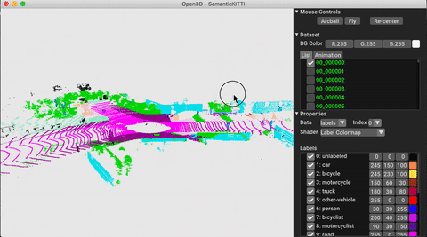

<p align="center">

<b style="font-size: 220%">ML</b>
</p>


[**Installation**](#installation) | [**Getting started**](#getting-started) | [**Repository structure**](#repository-structure) | [**Tasks and Algorithms**](#tasks-and-algorithms) | [**Model Zoo**](#model-zoo) | [**How-tos**](#how-tos) | [**Contribute**](#contribute)

Open3D-ML is an extension of Open3D for 3D machine learning tasks.
It builds on top of the Open3D core library and extends it with machine learning tools for 3D data processing.
This repo focuses on applications such as semantic point cloud segmentation and provides pretrained models that can be applied to common tasks as well as pipelines for training.

## Installation

### Requirements
Open3D-ML is integrated in the Open3D v0.11 python distribution.
To use all of the machine learning functionality you need to have installed PyTorch or TensorFlow.
Open3D v0.11 is compatible with the following versions

 * PyTorch 1.6
 * TensorFlow 2.3
 * CUDA 10.1 (optional)

If you need to use different versions we recommend to [build Open3D from source](http://www.open3d.org/docs/release/compilation.html).
- :warning: TODO add infos of how to compile the ml module to the main repo.

### Install commands
We provide pre-built pip packages that include Open3D-ML for Ubuntu 18.04+ with Python 3.6+ that can be installed with
```bash
$ pip install open3d
```

To test the installation use 
```bash
# with PyTorch
$ python -c "import open3d.ml.torch as ml3d"
# or with TensorFlow
$ python -c "import open3d.ml.tf as ml3d"
```


## Getting started


### Reading a dataset

```python
import open3d.ml.torch as ml3d  # or open3d.ml.tf as ml3d

# construct a dataset by specifying dataset_path
dataset = ml3d.datasets.SemanticKITTI(dataset_path='/path/to/SemanticKITTI/')

# get the 'all' split that combines training, validation and test set
all_split = dataset.get_split('all')

# print the attributes of the first datum
print(all_split.get_attr(0))
# returns  {'name': '00_000000', 
#           'path': '/path/to/SemanticKITTI/dataset/sequences/00/velodyne/000000.bin', 
#           'split': 'all'}

# print the shape of the first point cloud
print(all_split.get_data(0)['point'].shape)
# returns (124668, 3)

# show the first 100 frames using the visualizer
vis = ml3d.vis.Visualizer()
vis.visualize_dataset(dataset, 'all', indices=range(100))
```



### Running a pretrained model
```python
TODO
```

### Training a model
```python
TODO
```


## Repository structure
The core part of Open3D-ML lives in the `ml3d` subfolder, which is integrated into Open3D in the `ml` namespace.
In addition to the core part, the directories `examples` and `scripts` provide supporting scripts for getting started setting with seetting up a training pipeline or running a network on a dataset.

```
├─ docs                   # Markdown and rst files for documentation
├─ examples               # Place for example scripts and notebooks
├─ ml3d                   # Package root dir that is integrated in open3d
     ├─ configs           # Model configuration files
     ├─ datasets          # Generic dataset code; will be integratede as open3d.ml.{tf,torch}.datasets
     ├─ utils             # Framework independent utilities; available as open3d.ml.{tf,torch}.utils
     ├─ vis               # ML specific visualization functions
     ├─ tf                # Directory for TensorFlow specific code. same structure as ml3d/torch.
     │                    # This will be available as open3d.ml.tf 
     ├─ torch             # Directory for PyTorch specific code; available as open3d.ml.torch
          ├─ dataloaders  # Framework specific dataset code, e.g. wrappers that can make use of the 
          │               # generic dataset code.
          ├─ models       # Code for models
          ├─ modules      # Smaller modules, e.g., metrics and losses
          ├─ pipelines    # Pipelines for tasks like semantic segmentation
├─ scripts                # Demo scripts for training and dataset download scripts
```


## Tasks and Algorithms

### Segmentation

The table shows the available models and datasets for the segmentation task and the respective scores.


| Model / Dataset    | SemanticKITTI | Toronto 3D | Semantic 3D | S3DIS |
|--------------------|---------------|------------|-------------|-------|
| RandLA-Net (tf)    |      scores   |            |             |       |
| RandLA-Net (torch) |               |            |             |       |
| KPConv     (tf)    |               |            |             |       |
| KPConv     (torch) |               |            |             |       |


## Model Zoo

[link](?)

## How-tos
- Visualize custom data
- Add new model

## Contribute 
There are many ways to contribute to this project. You can 
* implement a new model
* add code for reading a new dataset
* share parameters and weights for an existing model
* report problems and bugs

Open3D is a community effort. We welcome and celebrate contributions from the community!

For adding new features, please create new pull requests.
For bugs and problems, [open an issue](https://github.com/intel-isl/Open3D-ML/issues). 
Please also check out our communication channels to get in contact with the community.

## Communication channels

<!--* [GitHub Issue](https://github.com/intel-isl/Open3D/issues): bug reports, feature requests, etc.-->
* [Forum](https://forum.open3d.org): discussion on the usage of Open3D.
* [Discord Chat](https://discord.gg/D35BGvn): online chats, discussions,
  and collaboration with other users and developers.

## Citation

Please cite [our work](https://arxiv.org/abs/1801.09847) if you use Open3D.

```bib
@article{Zhou2018,
    author    = {Qian-Yi Zhou and Jaesik Park and Vladlen Koltun},
    title     = {{Open3D}: {A} Modern Library for {3D} Data Processing},
    journal   = {arXiv:1801.09847},
    year      = {2018},
}
```

