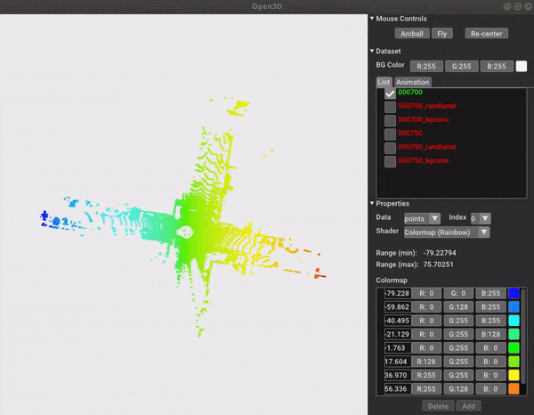
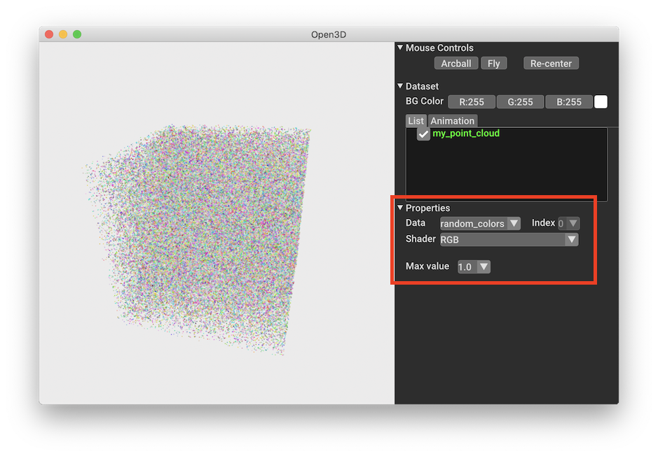
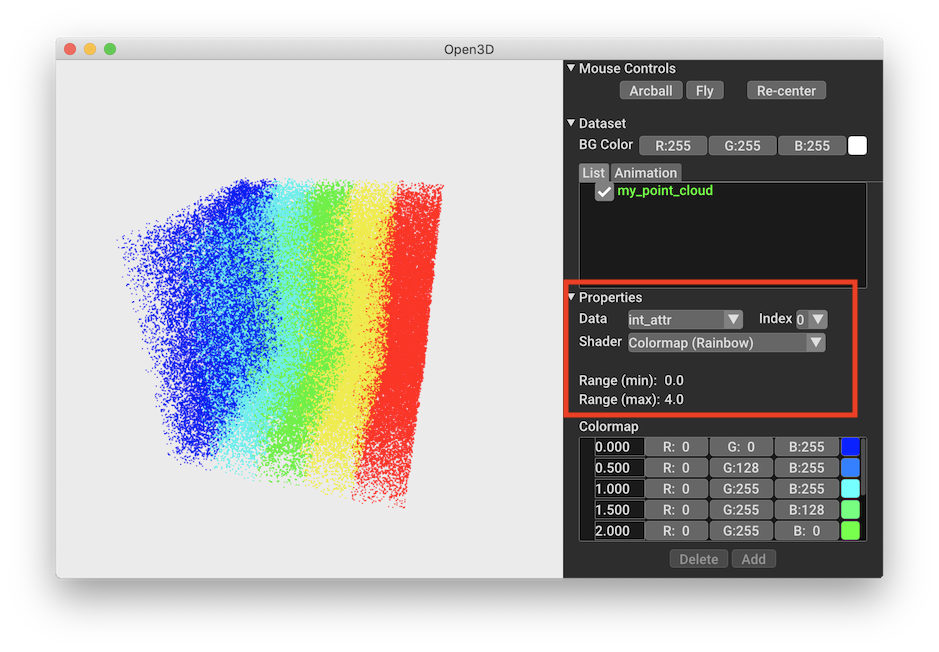
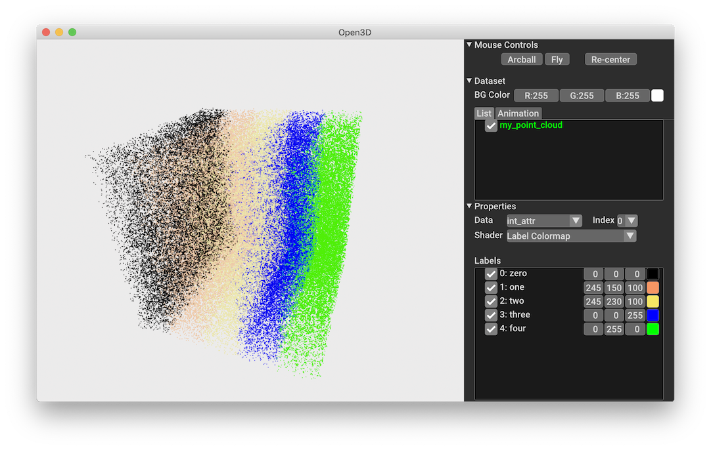

# How tos

This page is an effort to give short examples for common tasks and will be
extended over time.

## Visualize network predictions
Users can inspect the prediction results using the visualizer. Run `python examples/vis_pred.py` to see an example.

First, initialize a `Visualizer` and set up `LabelLUT` as label names to visualize. Here we would like to visualize points from `SemanticKITTI`. The labels can be obtained by `get_label_to_names()`
```python
    import os
    from os import path
    from os.path import exists
    from ml3d.vis import Visualizer, LabelLUT
    from ml3d.datasets import SemanticKITTI
    
    kitti_labels = SemanticKITTI.get_label_to_names()
    v = Visualizer()
    lut = LabelLUT()
    for val in sorted(kitti_labels.keys()):
        lut.add_label(kitti_labels[val], val)
    v.set_lut("labels", lut)
    v.set_lut("pred", lut)
```

Second, we will construct the networks and pipelines, load the pretrained weights, and prepare the data to be visualized.
```python
    from ml3d.torch.pipelines import SemanticSegmentation
    from ml3d.torch.models import RandLANet, KPFCNN

    kpconv_url = "https://storage.googleapis.com/open3d-releases/model-zoo/kpconv_semantickitti_202009090354utc.pth"
    randlanet_url = "https://storage.googleapis.com/open3d-releases/model-zoo/randlanet_semantickitti_202009090354utc.pth"
    
    ckpt_path = "./logs/vis_weights_{}.pth".format('RandLANet')
    if not exists(ckpt_path):
        cmd = "wget {} -O {}".format(randlanet_url, ckpt_path)
        os.system(cmd)
    model = RandLANet(ckpt_path=ckpt_path)
    pipeline_r = SemanticSegmentation(model)
    pipeline_r.load_ckpt(model.cfg.ckpt_path)

    ckpt_path = "./logs/vis_weights_{}.pth".format('KPFCNN')
    if not exists(ckpt_path):
        cmd = "wget {} -O {}".format(kpconv_url, ckpt_path)
        print(cmd)
        os.system(cmd)
    model = KPFCNN(ckpt_path=ckpt_path, in_radius=10)
    pipeline_k = SemanticSegmentation(model)
    pipeline_k.load_ckpt(model.cfg.ckpt_path)

    data_path = os.path.dirname(os.path.realpath(__file__)) + "/demo_data"
    pc_names = ["000700", "000750"]

    # see this function in examples/vis_pred.py, 
    # or it can be your customized dataloader,
    # or you can use the exsisting get_data() methods in ml3d/datasets
    pcs = get_custom_data(pc_names, data_path)
```

Third, we can run the inference and collect the results and send the results to `Visualizer.visualize(list_of_pointclouds_to_visualize)`. Note that the input to `visualize()` visualize is a list of point clouds and their predictions. Each point cloud is a dictionary like, 
```python
    vis_d = {
        "name": name,
        "points": pts, # n x 3
        "labels": label, # n
        "pred": pred_label, # n
    }
```
You will give its `name` and `points`. Other entries can be customized. For example, we can visualize its ground truth `label` and our prediction `pred` on a point cloud.

Here is the result by running `python examples/vis_pred.py`,


## Visualize custom data

The visualizer can be used to visualize point clouds with custom attributes.
This can be useful to for example for comparing predictions and the ground
truth.

Point clouds are defined as a dictionaries with mandatory entries **name** and
**points** defining the name of the object and the point positions.  In the
following example we create a single point cloud with an attribute
**random_colors** and an integer attribute **int_attr** in the range [0,4].
The data can be passed as PyTorch tensor, TensorFlow tensors or as numpy
arrays.

```python
import open3d.ml.torch as ml3d
# or import open3d.ml.tf as ml3d
import numpy as np

num_points = 100000
points = np.random.rand(num_points, 3).astype(np.float32)

data = [
    {
        'name': 'my_point_cloud',
        'points': points,
        'random_colors': np.random.rand(*points.shape).astype(np.float32),
        'int_attr': (points[:,0]*5).astype(np.int32),
    }
]

vis = ml3d.vis.Visualizer()
vis.visualize(data)
```

To visualize the **random_colors** attribute select it as _Data_ and choose the
RGB shader to directly interpret the values as colors. Max value is 1.0 in our
example.


To visualize the **int_attr** attribute select it as _Data_ and choose the
one of the colormap shaders, which will assign a color to each value. Here we
choose the rainbow colormap. Note that the colormap is automatically adjusted
to the range of the data. It is also possible to edit the colormap in the 
visualizer to adjust it to specific use cases.


### Setting a custom LUT

To use a custom LUT for visualizing attributes we first define the table with

```python
lut = ml3d.vis.LabelLUT()
lut.add_label('zero', 0)
lut.add_label('one', 1)
lut.add_label('two', 2)
lut.add_label('three', 3, [0,0,1]) # use blue for label 'three'
lut.add_label('four', 4, [0,1,0])  # use green for label 'four'
```
If no color is provided when adding a label a color will be assigned from a
default LUT.

To pass the LUT to the visualizer we associate it with the **int_attr**.
```python
vis.set_lut("int_attr", lut)
vis.visualize(data)
```
Selecting the **int_attr** in the visualizer will then switch to our LUT.



## Adding a new model

For adding a new model to Open3D-ML you need to clone the repository and add
the model code to `ml3d/{tf,torch}/models`.

All models should be derived from `BaseModel` defined in
`ml3d/{tf,torch}/models/base_model.py` and must implement a set of functions
that allow a pipeline to interact with the model. A minimal model for torch 
looks like this.

```python
# use relative import for all imports within ml3d.
from .base_model import BaseModel

class MyModel(BaseModel):
    def __init__(self, name="MyModel"):
        super().__init__(name=name)
        # network definition ...

    def forward(self, inputs):
        # inference code ...

    def get_optimizer(self, cfg_pipeline):
        optimizer = torch.optim.Adam(self.parameters(), lr=cfg_pipeline.adam_lr)
        scheduler = torch.optim.lr_scheduler.ExponentialLR(optimizer, cfg_pipeline.scheduler_gamma)
        return optimizer, scheduler
    
    def get_loss(self, Loss, results, inputs):
        labels = inputs['data'].labels # processed data from model.preprocess and/or model.transform.

        # Loss is an object of type SemSegLoss. Any new loss can be added to `ml3d/{tf, torch}/modules/semseg_loss.py`
        loss = Loss.weighted_CrossEntropyLoss(results, labels)
        results, labels = Loss.filter_valid_label(results, labels) # remove ignored indices if present.
        return loss, labels, results

    def preprocess(self, data, attr):
        return data
```


## Adding a new dataset

For adding a new dataset, you can add the dataset code to `ml3d/datasets`.
A Dataset class is independent of an ML framework and has to be derived from 
`BaseDataset` defined in `ml3d/datasets/base_dataset.py`. You must implement 
another class `MyDatasetSplit` which is used to return data and attributes 
for files corresponding to a particular split.

```python
from .base_dataset import BaseDataset

class MyDataset(BaseDataset):
    def __init__(self, name="MyDataset"):
        super().__init__(name=name)
        # read file lists.
     
    def get_split(self, split):
        return MyDatasetSplit(self, split=split)
    
    def is_tested(self, attr):
        # checks whether attr['name'] is already tested.
    
    def save_test_result(self, results, attr):
        # save results['predict_labels'] to file.
    

class MyDatasetSplit():
    def __init__(self, dataset, split='train'):
        self.split = split
        self.path_list = []
        # collect list of files relevant to split.
    
    def __len__(self):
        return len(self.path_list)
    
    def get_data(self, idx):
        path = self.path_list[idx]
        points, features, labels = read_pc(path)
        return {'point': points, 'feat': features, 'label': labels}
    
    def get_attr(self, idx):
        path = self.path_list[idx]
        name = path.split('/')[-1]
        return {'name': name, 'path': path, 'split': self.split}
    
```

To test code with an already installed Open3D package you can set the
environment variable `OPEN3D_ML_ROOT` to the root dir of the repo. This can be
done with
```bash 
source /path/to/Open3D-ML/set_open3d_ml_root.sh
```
which will make the _ml_ namespace point to `ml3d` in the repo.
Our example model can then be instantiated with
```python
import open3d.ml.torch as ml3d
# prints "Using external Open3D-ML in /path/to/Open3D-ML"

model = ml3d.models.MyModel()
dataset = ml3d.datasets.MyDataset()
```
